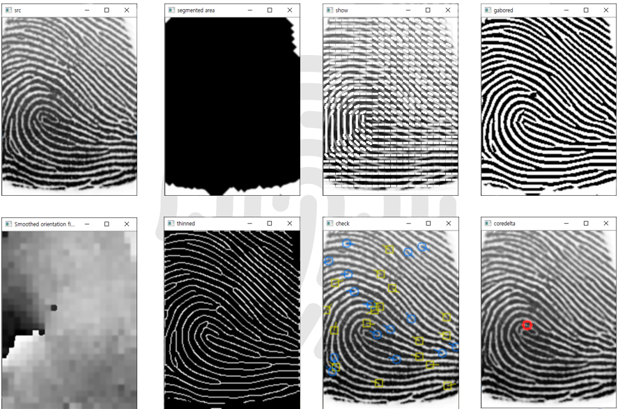
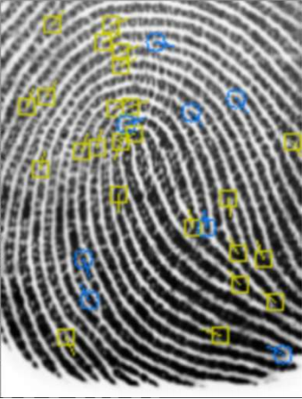
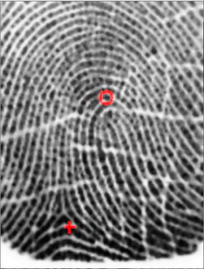

# Fingerprint-Recognition

Implement Fingerprint Minutiae Detection Using C++ and OpenCV

-- VisualStudio 2017, OpenCV 4.0.1

## Overall Processing

Normalization and Segementation -> orientation -> gabor filtering -> thinning -> detection

## Fingerprint Minutiae Detection

Find Ending Points and Bifarcation Points

## Fingerprint Core and Delta Detection

Find Core and Delta
